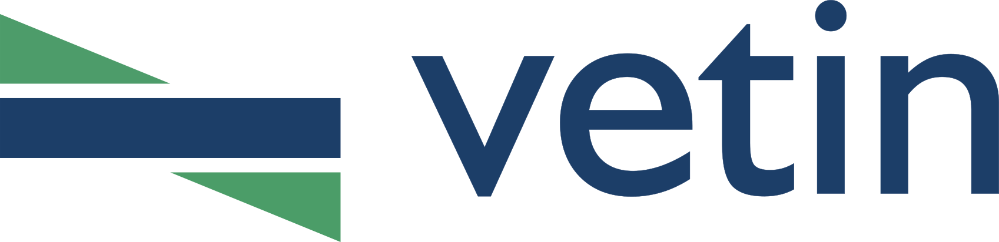

# Vetin | Torsion

**A browser-based computational tool for the torsional analysis of circular, annular (hollow circular), rectangular and square cross-sections — including composite shafts built from concentric rings of different materials — with interactive stress-distribution drawing and 3D visualisation of the twisted (and warped) member.**

[](https://opensource.org/licenses/MIT)
[](https://web.dev/progressive-web-apps/)
[](#-multilingual-support)

> Developed by **Assoc. Prof. Rasim Temür** · İstanbul University-Cerrahpaşa, Department of Civil Engineering  
> Part of the **Vetin** initiative for the digitisation of academic instruction tools.

---

## 🌐 Online Access

> **[https://www.rasimtemur.com/vetin/torsion/](https://www.rasimtemur.com/vetin/torsion/)**

The application is accessible directly through a web browser without requiring any software installation, user registration, or server-side processing. All computations are performed client-side.

---

## 📋 Description

**Vetin Torsion** is an open-source, web-based application developed for educational use in mechanics of materials curricula. It enables the interactive construction of shaft cross-sections — solid circles, rings (annuli), rectangles and squares — and computes the shear-stress distribution produced by a torsional moment.

Two distinct theories are involved, and the application keeps them apart. A circular cross-section is the one shape that **remains plane** under torsion, which is why the elementary formula τ = T·ρ/I<sub>p</sub> is exact for it. Every non-circular section **warps** out of plane, and a rectangle must be solved with **Saint-Venant torsion theory**, in which neither the stress distribution nor the location of the maximum stress follows the circular intuition. Because the two rest on incompatible kinematic assumptions, the application **refuses to combine them in one section** rather than summing quantities that are not additive.

Beyond homogeneous sections, the application solves **composite shafts** consisting of **concentric rings made of different materials** (different shear moduli *G*). The stress diagram along a diameter, including the characteristic *jumps* at material interfaces, is drawn on the section in real time.

**Key properties of the application:**

- Operates entirely within the client browser; no server-side computation is required
- Functions offline as a **Progressive Web App (PWA)**
- User interface is localised in **33 languages**
- Supports **multi-material concentric sections** (e.g. a steel core inside a brass sleeve)
- Closed-form and exact-series solutions throughout — no meshing, no numerical integration
- Source code is freely distributed under the **MIT License**

---

## ⚙️ Functional Capabilities

### Cross-Section Drawing

| Tool | Description |
|------|-------------|
| **Circle** | Add a solid circular region (drag from centre outwards) |
| **Ring** | Add an annular region with three clicks: the centre, then either of the two diameters, then the other (the larger becomes the outer radius) |
| **Rectangle** | Add a solid rectangular region by dragging corner to corner; hold *Shift* for a square. One rectangle per section, and not combinable with circular parts |

New circular parts automatically **snap to the common centre** of the existing section, so composite sections are always concentric — a requirement of the theory (see [Assumptions](#-theory-assumptions-and-limitations)). In **Edit** mode radii and rectangle edges can be adjusted by dragging handles, and the whole section can be repositioned. Each part's dimensions (*r*<sub>o</sub>, *r*<sub>i</sub> for circular parts; *b*, *h* for a rectangle) and its shear modulus *G* can also be edited numerically in the section list.

### Computed Quantities

**Section properties** (exact, closed-form — no numerical integration):
- *A* — net cross-sectional area
- *I*<sub>x</sub>, *I*<sub>y</sub>, *I*<sub>xy</sub> — centroidal second moments of area
- *I*<sub>p</sub> (circular) or *I*<sub>t</sub> (rectangular) — the **torsion constant** of the section
- *W*<sub>t</sub> — torsional section modulus (*I*<sub>p</sub>/ρ<sub>max</sub> for a circular section, α·*a*·*b*² for a rectangle); for a **homogeneous** section τ<sub>max</sub> = *T*/*W*<sub>t</sub>, whereas in a composite shaft the stress follows from *G*<sub>i</sub>·θ′·ρ and *W*<sub>t</sub> remains a purely geometric quantity

**Torsional response** for an applied torque *T*:
- Σ*G*·*I*<sub>p</sub> (circular) or *G*·*I*<sub>t</sub> (rectangular) — torsional rigidity of the section
- θ — rate of twist (°/m)
- τ<sub>max</sub>, and τ<sub>min</sub> (circular, at the bore) or τ<sub>2</sub> (rectangular, at the midpoint of the short side)
- Per-material stresses τ<sub>in</sub>, τ<sub>out</sub> at the inner and outer radii of each ring

For a rectangular section the result panel switches its labels to the quantities that actually govern it: **I<sub>t</sub>**, **W<sub>t</sub>**, **G·I<sub>t</sub>** and **τ<sub>2</sub>**. The distinction matters: for a non-circular section the polar moment *I*<sub>p</sub> is **not** the torsion constant, and displaying it would be misleading.

### Graphical Output

- Colour-coded materials (each part drawn in its own material colour). Each of the three themes — light, dark and blueprint — carries its **own** palette rather than reusing the light pastels, which washed out on a dark canvas and clashed with blueprint's blue paper. The palettes are anchored to the 3D view: a theme's first material colour *is* the 3D bar colour, and the 2D canvas background *is* the 3D scene background, so the same section reads the same in both panels
- **Circular sections** — the shear-stress diagram is drawn over the full vertical diameter on an opaque background, so it reads as a block laid over the section. Since τ is tangential, the arrows are horizontal and reverse across the centre (antisymmetric). The envelope is linear within each material and jumps at material interfaces; **both sides of a jump are labelled**, τ<sub>mak</sub> and τ<sub>min</sub> appear at both ends of the diameter, and the envelope continues as a dashed line across the bore of a hollow section
- **Rectangular sections** — the diagram is drawn along both centroidal axes with tangential (perpendicular) arrows: τ<sub>mak</sub> at the midpoints of the long sides, τ<sub>2</sub> at the midpoints of the short sides, and zero at the corners. The envelope follows the **exact series profile**, which is not linear
- **Rectangular sections, diagram path** — *Diagram along: Axes / Diagonal / All* chooses where the diagram is drawn. **Diagonal** replaces the two symmetry axes with a **single diagonal**; **All** shows the horizontal axis, the vertical axis and the diagonal together in one figure. A diagonal is not a symmetry axis (except in a square), and it makes a point the axis diagrams cannot: τ vanishes at **both** ends of the diagonal — at the centroid *and* at the corner — with a single maximum in between, worth ≈0.46·τ<sub>mak</sub> for a square rising to ≈0.60·τ<sub>mak</sub> at 4:1. Ordinates are the stress **magnitude** |τ|, computed from the exact stress field at each point and plotted normal to the diagonal in the usual diagram convention. Note that the arrow **length** carries the magnitude while its direction only marks the sense of twist: the true τ vector is normal to the diagonal only in a square, and leans towards the long-side direction as the rectangle lengthens (≈15° off the diagonal at 4:1). Every mode uses the same scale, so switching between them compares the three paths directly. Because the distribution is antisymmetric about the centroid, a single-path mode draws both lobes of its line; *All* draws **one lobe each** — one horizontal, one vertical, one diagonal — and drops the corner τ = 0 label, which would otherwise collide with the axis label on a square (the envelope still visibly returns to the baseline there)
- Torque *M*<sub>b</sub> — a compact circular arrow near the centroid, turning in the same sense as the shear-stress arrows (the τ distribution equilibrates this torque), with its gap left open along the radius dimension arrows; the sense follows the sign of *T*
- **Radius dimensioning** — an arrow from the centre to each circle, labelled *R* for a solid part and *R*<sub>d</sub> / *R*<sub>i</sub> for a ring (part number appended in composite sections; a circle shared by two parts is dimensioned once). Rectangles are dimensioned by their overall *b* × *h*
- Centroidal axes, centroid marker, dimension lines, part borders — each toggleable
- **SVG export** of the section drawing; **JSON save/load** of the project (format v2.1)

### 3D Visualisation

An interactive 3D view (Three.js/WebGL) extrudes the section along the member axis with per-material colours, wireframe/edge toggles and fullscreen support. Dragging with the **left** mouse button pans, the **right** button orbits, and the **middle** button zooms (as does the scroll wheel); on touch, one finger orbits and pinch zooms.

Orientation is controlled by an **AutoCAD-style ViewCube** in the corner of the 3D panel: the cube always shows the current camera direction, clicking one of its faces swings the camera to that view, and dragging the cube orbits freely. Six labelled buttons below it (front, back, left, right, top and isometric) do the same for the axis views. A view change only rotates the camera — the zoom level and the panned centre are preserved, as in CAD; *Fit All* is what re-frames the model. Looking straight down the axis keeps the same left-right orientation as the front view, so the member does not appear to spin when switching between them.

The camera re-fits itself **only when the bar geometry changes**. Changing the torque rebuilds the deformed bar, and the twisted shape's bounding box grows with it, so an unconditional auto-fit made the view zoom in and out on every step of the torque slider — the load is what the user is watching, and it was the one thing the camera would not hold still for. The torque is therefore excluded from the fit trigger: dragging the slider leaves the viewpoint, and any zoom the user has set, exactly where it was. *Fit All* still re-fits on demand.

**Deformed shape** — the bar can be drawn in its twisted state: each cross-section is rotated by φ(z) = θ′·z, and a rectangular section additionally **warps** out of plane by *w* = θ′·ψ(x, y) — a circular section does not warp (ψ ≡ 0), which is exactly why the elementary formula holds for it. The warping function ψ is the exact series solution of ∇²ψ = 0 with the free-surface condition.

Two axis triads are drawn at the centre of the **free end** face. The coloured one is attached to the cross-section: it rotates with it by exactly the same φ(L) = k·θ′·L used to draw the deformed body, so the twist is readable as an angle rather than inferred from the surface. The second triad is the **fixed end's** frame, carried to the same origin and drawn in grey tones — it does not rotate, so the angle between the two triads *is* the visualised end rotation. The grey reference appears only while there is a twist to compare against; with zero torque, or with the deformed shape switched off, the two would coincide exactly and only the section triad is drawn.

Real twist angles are far too small to see (thousandths of a degree), so the shape is drawn with an **exaggeration factor**, exactly as in finite-element post-processing. The factor is deliberately **independent of the applied torque** — it is calibrated from the section's own rigidity so that a 1 kNm reference torque would show ≈25° of end rotation. The drawn twist is therefore **directly proportional to *T***: doubling the torque doubles the visible twist. (An auto-factor recomputed from the current torque would cancel it out and leave the picture unchanged whatever the load.) Very large torques are clamped to keep the model readable, and the label reports it. The **true** end rotation θ′·*L* is always reported alongside, and the factor can be overridden manually. A single factor scales all displacement components, so their relative proportions stay physical; the warping is therefore small next to the accumulated twist of a slender bar.

Because a circular bar's outer surface is a surface of revolution, twisting it leaves the silhouette unchanged. Longitudinal **reference lines** — straight before deformation, helical after — are drawn on the surface (at the corners of a rectangle) so that the twist is visible for every section type.

The lateral surface is outlined with **transverse cross-section contours** (toggleable, drawn at any torque including zero) rather than mesh edges: on a twisted surface the two triangles of each quad no longer share a normal, so an edge detector reports the triangulation diagonals instead of real edges. The contours are generated from the section outline itself, so they follow the twisted — and, for a rectangle, warped — surface exactly; with no torque they are simply straight cross-sections along the bar. Contours and longitudinal lines are drawn in the section's own border colour.

For the same reason the shading uses **crease-angle normal smoothing** instead of per-triangle normals: normals are averaged between neighbouring faces whose angle stays under a threshold, so the twisted surface shades continuously while the 90° corners of a rectangle and the section/lateral boundary stay sharp. Without it the mesh triangles show up as alternating tones.

---

## 📐 Theory, Assumptions, and Limitations

### Notation

| Symbol | Meaning | Unit in the interface |
|--------|---------|------------------------|
| *T* | applied torsional moment (torque) | kNm |
| *G* | shear modulus of a material | GPa |
| θ′ | rate of twist (twist per unit length) | rad/mm (internally) |
| θ | rate of twist as reported | °/m |
| τ | shear stress | MPa |
| ρ | radial distance from the axis (circular sections) | mm |
| *r*<sub>o</sub>, *r*<sub>i</sub> | outer / inner radius of a ring | mm |
| *b*, *h* | width and height of a rectangle | mm |
| *a*, *b* | long and short side of a rectangle (theory), *q* = *a*/*b* ≥ 1 | mm |
| *I*<sub>p</sub> | polar second moment of area | mm⁴ |
| *I*<sub>t</sub> | torsion constant (Saint-Venant) | mm⁴ |
| *W*<sub>t</sub> | torsional section modulus, τ<sub>max</sub> = *T*/*W*<sub>t</sub> | mm³ |
| φ | Prandtl stress function | — |
| ψ | warping function, *w* = θ′·ψ | mm² |
| α, β, γ | rectangle coefficients: τ<sub>max</sub> = *T*/(α·a·b²), *I*<sub>t</sub> = β·a·b³, τ<sub>2</sub> = γ·τ<sub>max</sub> | — |

### The problem being solved

The application solves **uniform (pure) Saint-Venant torsion of a prismatic bar**: a straight member of constant cross-section loaded only by equal and opposite torques at its ends, free to warp along its entire length. This is the classical problem treated in mechanics-of-materials and theory-of-elasticity courses, and it is the reference case against which more complex situations (warping restraint, variable section, combined loading) are compared.

### Assumptions common to both section families

1. **Linear elastic material.** Hooke's law in shear, τ = *G*·γ, holds throughout. No yielding, no non-linearity, no unloading history. All results therefore scale linearly with *T*.
2. **Homogeneous and isotropic material within each part.** A part is described by a single shear modulus *G*; the material has no directional dependence.
3. **Prismatic member.** The cross-section is constant along the member axis; there are no tapers, holes, notches, keyways or fillets.
4. **Uniform torsion with free warping.** The torque is constant along the bar and warping is unrestrained at every section, so no axial (warping normal) stresses arise: σ<sub>z</sub> = 0 and the only non-zero stresses are the two transverse shear components τ<sub>zx</sub>, τ<sub>zy</sub>. This is what distinguishes Saint-Venant torsion from **non-uniform (Vlasov) torsion**, where restrained warping produces a bimoment and axial stresses.
5. **Constant rate of twist.** Because *T*, *G* and the section are constant, the rate of twist θ′ (rotation per unit length) is the same at every section, and the total rotation of a bar of length *L* is θ′·*L*.
6. **Small displacements and small rotations.** Geometric linearity; equilibrium is written on the undeformed geometry. The 3D deformed shape is an exaggerated visualisation, not a large-displacement analysis.
7. **Pure torsion only.** No axial force, bending moment or transverse shear is considered, so no interaction or combined-stress check is performed.
8. **Saint-Venant's principle.** The solution describes the state away from the ends; the local disturbance where the torque is actually introduced, and any support detail, is outside the model.
9. **Torque applied about the centroidal axis.** All sections treated here (circle, annulus, rectangle) are doubly symmetric, so the shear centre coincides with the centroid and the twist axis is the centroidal axis.

### Circular and annular sections

For a circular or annular section — and **only** for these — the assumed kinematics are exact:

- **Cross-sections remain plane** and radii remain straight; each section rotates as a rigid disc about the axis. The warping function vanishes identically (ψ ≡ 0).
- **Compatibility:** the shear strain at radius ρ is θ′·ρ, varying linearly from zero at the axis.
- **Constitutive law:** τ(ρ) = *G*·θ′·ρ.
- **Equilibrium:** *T* = ∬ τ·ρ d*A*.

For a homogeneous section this yields the classical result

> τ(ρ) = *T*·ρ / *I*<sub>p</sub>,  τ<sub>max</sub> = *T*·ρ<sub>max</sub> / *I*<sub>p</sub> = *T* / *W*<sub>t</sub>,  θ′ = *T* / (*G*·*I*<sub>p</sub>)

with section properties evaluated in closed form for each part (*r*<sub>i</sub> = 0 for a solid circle):

- *A*<sub>i</sub> = π (*r*<sub>o</sub>² − *r*<sub>i</sub>²)
- *I*<sub>x,i</sub> = *I*<sub>y,i</sub> = (π/4)(*r*<sub>o</sub>⁴ − *r*<sub>i</sub>⁴)
- *I*<sub>p,i</sub> = *J*<sub>i</sub> = (π/2)(*r*<sub>o</sub>⁴ − *r*<sub>i</sub>⁴)

#### Composite (multi-material) shafts

Additional assumptions:

10. **Concentric parts.** All rings share a common centre, so a single twist axis exists. The application enforces this when parts are drawn and reports an error otherwise.
11. **Perfect bond at the interfaces.** No slip occurs between adjacent materials, so the displacement — and therefore the shear *strain* — is continuous across an interface.
12. **Parts do not overlap.** Material regions are radially disjoint; overlapping geometry is rejected.

The rings twist together, so the rate of twist is common to all materials:

- **Compatibility:** the shear strain at radius ρ is θ′·ρ in *every* material
- **Equilibrium:** *T* = θ′ · Σ (*G*<sub>i</sub> · *I*<sub>p,i</sub>) → θ′ = *T* / Σ (*G*<sub>i</sub> · *I*<sub>p,i</sub>)
- **Stress in material *i*:** τ<sub>i</sub>(ρ) = *G*<sub>i</sub> · θ′ · ρ

Two consequences are worth emphasising, and both are drawn by the application:

- The **strain** is continuous across an interface but the **stress is not**: it jumps in proportion to the ratio of the shear moduli. Two different values therefore exist at the same radius, one for each material.
- τ<sub>max</sub> need **not** occur at the outer surface. If an inner material is considerably stiffer, the largest stress may occur at an internal interface; the application searches all band edges rather than assuming the outermost one.

For a single material these expressions reduce to the classical τ = *T*·ρ/*I*<sub>p</sub>.

### Rectangular and square sections (Saint-Venant torsion)

A non-circular section **warps**: points of the cross-section displace along the member axis by *w* = θ′·ψ(x, y). Assumptions 1–9 above still hold, but the plane-section kinematics do not, and consequently:

- τ = *T*·ρ/*I*<sub>p</sub> is **invalid**;
- the maximum stress does **not** occur at the point farthest from the centroid — it occurs at the **midpoint of the long side**, which is the boundary point *nearest* the axis;
- the shear stress at the **corners is zero**, because at a free surface the shear stress must be tangent to the boundary and a corner belongs to two mutually perpendicular faces.

The problem is solved by Saint-Venant's semi-inverse method through the **Prandtl stress function** φ:

> ∇²φ = −2·*G*·θ′ inside the section,  φ = 0 on the boundary,  
> τ<sub>zx</sub> = ∂φ/∂y,  τ<sub>zy</sub> = −∂φ/∂x,  *T* = 2∬ φ d*A*

Equivalently, in terms of the warping function, ∇²ψ = 0 with the free-surface condition ∂ψ/∂n = y·n<sub>x</sub> − x·n<sub>y</sub>. Both forms are used in the application: φ supplies the stresses and the torsion constant, ψ supplies the out-of-plane deformation drawn in the 3D view.

With *a* the long side, *b* the short side and *q* = *a*/*b* ≥ 1:

- **Torsion constant:** *I*<sub>t</sub> = β·*a*·*b*³ (≠ *I*<sub>p</sub>)
- **Rate of twist:** θ′ = *T* / (*G*·*I*<sub>t</sub>)
- **Maximum stress**, at the midpoint of the long side: τ<sub>max</sub> = *T* / (α·*a*·*b*²) = *T*/*W*<sub>t</sub>
- **Stress at the midpoint of the short side:** τ<sub>2</sub> = γ·τ<sub>max</sub>

The coefficients α, β, γ are evaluated from the **exact series solution** rather than interpolated from a table. The hyperbolic terms are rewritten so that the sums converge exponentially, and a handful of terms suffice at any aspect ratio:

- β = 1/3 − (64/π⁵)(1/*q*) · Σ<sub>n odd</sub> tanh(nπ*q*/2)/n⁵
- τ<sub>max</sub> = k₁·*G*·θ′·*b*, with k₁ = 1 − (8/π²) Σ<sub>n odd</sub> 1/(n² cosh(nπ*q*/2))
- α = β/k₁, and γ from the corresponding series at the short-side midpoint

Limiting cases reproduce the familiar results: for a **square**, α = 0.208, β = 0.141 and γ = 1 (all four mid-sides equally stressed); for a **thin strip** (*q* → ∞), α, β → 1/3 and γ → 0.742, i.e. *I*<sub>t</sub> → *a·b*³/3 and τ<sub>max</sub> → 3*T*/(*a·b*²).

Away from the two centroidal axes the closed-form mid-side profiles no longer apply, so the **full stress field** is evaluated from φ directly — this is what the diagonal diagram plots:

> τ<sub>zx</sub> = *G*θ′ [ −2*y* + (8*h*/π²) Σ<sub>n odd</sub> (−1)<sup>(n−1)/2</sup>/n² · cosh(nπ*x*/*h*)/cosh(nπ*w*/2*h*) · sin(nπ*y*/*h*) ]  
> τ<sub>zy</sub> = *G*θ′ (8*h*/π²) Σ<sub>n odd</sub> (−1)<sup>(n−1)/2</sup>/n² · sinh(nπ*x*/*h*)/cosh(nπ*w*/2*h*) · cos(nπ*y*/*h*)

with *x*, *y* measured from the centroid and the shorter side taken along *y* so that the series decay exponentially. Evaluated at the mid-sides these reduce **exactly** to k₁·*G*θ′·*b* and k₂·*G*θ′·*b*, and the field is antisymmetric about the centroid, τ(−**P**) = −τ(**P**) — which is why the diagonal ordinates fall on opposite sides of the baseline in the two halves.

**Why the two families are never mixed.** Circular and rectangular torsion rest on incompatible kinematic assumptions — plane sections versus warping — and their stiffnesses are not additive across such a boundary. A section therefore holds *either* concentric circular parts *or* a single rectangle; the application blocks the combination both while drawing and while computing.

### What is deliberately not modelled

Being explicit about the boundaries of the model is part of using it correctly:

- **Warping restraint (non-uniform / Vlasov torsion)** — no bimoment, no warping normal stresses, no torsional buckling
- **Plasticity, creep, fatigue, temperature effects** — the response is linear elastic throughout
- **Stress concentrations** — fillets, keyways, holes, re-entrant corners and other geometric discontinuities
- **End and support effects** — only the Saint-Venant region is described
- **Combined loading** — no axial, bending or shear interaction; no principal-stress or yield-criterion check (the state is pure shear, so principal stresses of ±τ act at 45° to the axis)
- **Hollow rectangular (box) sections** — these require thin-walled Bredt–Batho theory (*I*<sub>t</sub> = 4*A*<sub>m</sub>²/∮(d*s*/*t*)), which is a different formulation and is out of scope
- **Open thin-walled profiles** (L, T, I sections built from rectangles, *I*<sub>t</sub> ≈ Σ *h*<sub>i</sub>*b*<sub>i</sub>³/3) and **arbitrary polygonal sections**
- **Composite (multi-material) rectangles** — no elementary solution exists for a warping composite section
- **Non-concentric circular assemblies** — a single twist axis is assumed
- The **3D deformed shape is a scaled visualisation**, not a stress plot or a large-displacement analysis

### Verification

The implementation is checked against independent references rather than against itself:

- **Circular and composite sections** use closed-form expressions; the composite results are verified against hand calculations and against the limiting single-material case.
- **Rectangle coefficients** reproduce the published Timoshenko/Roark tables across the full range of aspect ratios (α, β to ±0.0015 and γ to ±0.0025), satisfy the square-symmetry condition γ = 1 exactly, converge to the thin-strip limits, and agree with an **independent finite-difference solution** of ∇²φ = −2*G*θ′ to within 0.02 %.
- **The stress field** used by the diagonal diagram is checked against an independent finite-difference solution of the Prandtl equation over the whole section (worst-case deviation below 0.1 % of τ<sub>max</sub> at aspect ratios from 1:1 to 4:1), reproduces k₁ and k₂ exactly at the mid-sides, and returns zero at the centroid and at the corners.
- **The warping function ψ** is verified by confirming ∇²ψ = 0, by checking the free-surface boundary condition, and — the decisive test — by recovering the torsion constant from it, *I*<sub>t</sub> = ∬ (x² + y² + x·∂ψ/∂y − y·∂ψ/∂x) d*A*, which matches β·*a*·*b*³ to better than 0.01 % for common aspect ratios and 0.05 % for a 10:1 strip.
- The drawing, interaction and file-format logic is covered by an automated test suite that exercises the application's own functions.

---

## 🌐 Multilingual Support

The user interface is localised in **33 languages**, selectable at runtime and persisted via `localStorage`:

| Code | Language | Code | Language | Code | Language |
|------|----------|------|----------|------|----------|
| `tr` | 🇹🇷 Turkish | `en` | 🇬🇧 English | `de` | 🇩🇪 German |
| `fr` | 🇫🇷 French | `es` | 🇪🇸 Spanish | `it` | 🇮🇹 Italian |
| `pt` | 🇧🇷 Portuguese | `ru` | 🇷🇺 Russian | `ro` | 🇷🇴 Romanian |
| `bg` | 🇧🇬 Bulgarian | `el` | 🇬🇷 Greek | `sl` | 🇸🇮 Slovenian |
| `sq` | 🇦🇱 Albanian | `hy` | 🇦🇲 Armenian | `ka` | 🇬🇪 Georgian |
| `he` | 🇮🇱 Hebrew | `ar` | 🇸🇦 Arabic | `fa` | 🇮🇷 Persian |
| `ur` | 🇵🇰 Urdu | `hi` | 🇮🇳 Hindi | `bn` | 🇧🇩 Bengali |
| `ne` | 🇳🇵 Nepali | `dz` | 🇧🇹 Dzongkha | `my` | 🇲🇲 Burmese |
| `th` | 🇹🇭 Thai | `id` | 🇮🇩 Indonesian | `tl` | 🇵🇭 Filipino |
| `zh` | 🇨🇳 Chinese | `ja` | 🇯🇵 Japanese | `ko` | 🇰🇷 Korean |
| `uz` | 🇺🇿 Uzbek | `tg` | 🇹🇯 Tajik | `ky` | 🇰🇬 Kyrgyz |

---

## 🛠️ Technical Implementation

| Technology | Role |
|-----------|------|
| **HTML5 / CSS3 / JavaScript (ES6+)** | Core application architecture |
| **HTML5 Canvas API** | Section drawing and stress visualisation |
| **Three.js (WebGL)** | Interactive 3D member visualisation |
| **SVG** | Vector export of section drawings |
| **Service Worker API** | Offline caching and PWA functionality |
| **Web App Manifest** | Home screen installation support |
| **localStorage API** | Persistence of user preferences (language, theme) |

---

## 📁 Project Structure

```
torsion/
├── index.html              # Application entry point and HTML shell
├── manifest.json           # PWA manifest descriptor
├── sw.js                   # Service Worker (offline caching)
│
├── script.js               # Torsion computations, canvas drawing, UI logic
├── script3d.js             # Three.js 3D visualisation and deformed shape
│
├── translations.js         # Localisation string repository (33 languages)
│
├── style.css               # Base styles, themes (light / dark / blueprint)
│
├── logo.svg                # Application logotype
├── icon.svg                # Source vector icon
├── IUC.svg                 # İstanbul University-Cerrahpaşa logo
├── icon-192.png            # PWA icon (192 × 192 px)
└── icon-512.png            # PWA icon (512 × 512 px)
```

---

## 🚀 Local Execution

As the application comprises static files only, it may be served locally with any HTTP server:

```bash
# Python 3 — built-in HTTP server
python -m http.server 8000

# Node.js — via npx
npx serve .
```

Navigate to `http://localhost:8000` in a web browser to launch the application. On PWA-capable browsers the application may be installed to the device home screen for offline use.

---

## 📖 Usage

1. **Draw the cross-section** — Use the **Circle** tool for a solid shaft, or the **Ring** tool for a hollow shaft: click the centre, then one diameter, then the other — the ring is created in one go (press *Esc* to cancel a half-finished ring). Add further concentric rings for composite sections; they snap to the common centre automatically. For a **rectangular or square** shaft use the **Rectangle** tool (drag corner to corner, *Shift* for a square) — one rectangle per section, and it cannot be combined with circular parts.
2. **Assign materials and dimensions** — In the *Kesitler* (Sections) list, set each part's shear modulus **G** (GPa). Dimensions can be edited numerically there as well: *r*<sub>d</sub> / *r*<sub>i</sub> for circular parts, *b* / *h* for a rectangle.
3. **Apply the torque** — Enter the torsional moment **T** (kNm) or drag the slider beneath it; the section drawing, the results and the 3D deformed shape follow live (double-click the slider to return to zero). Negative values reverse the twist direction. Typing a value beyond the slider's range widens it.
4. **Read the results** — τ<sub>max</sub> and τ<sub>min</sub> (or τ<sub>2</sub> for a rectangle), per-material interface stresses, *I*<sub>p</sub> / *I*<sub>t</sub>, *W*<sub>t</sub>, Σ*G*·*I*<sub>p</sub> / *G*·*I*<sub>t</sub> and the rate of twist θ update instantly.
5. **Inspect the diagram** — For a circular section the distribution is drawn over the full vertical diameter, with the tangential arrows reversing across the centre and jumping at material interfaces. For a rectangle it is drawn along both centroidal axes, with the maximum at the midpoints of the long sides and zero at the corners.
6. **Study the deformation** — Switch on the 3D view to see the twisted member; for a rectangle the warping of the cross-section is included. The exaggeration factor and the true end rotation are reported in the 3D settings.
7. **Export** — Export the drawing as SVG, or save/load the project as JSON.

---

## 📜 License

This software is distributed under the **MIT License**.  
Full license terms are available in the [LICENSE](LICENSE) file.

---

## 👤 Developer

**Assoc. Prof. Rasim Temür**  
Department of Civil Engineering  
İstanbul University-Cerrahpaşa  
🌐 [rasimtemur.com](https://www.rasimtemur.com)

---

## 🔗 Vetin Project

Vetin is a collection of open-source, browser-based computational tools developed for use in civil and structural engineering education. Additional tools within the Vetin ecosystem are accessible at **[rasimtemur.com/vetin](https://www.rasimtemur.com/vetin)**.

---

<p align="center">
  <i>Developed in support of engineering education.</i><br>
  <a href="https://opensource.org/licenses/MIT">MIT License</a> ·
  <a href="https://www.iuc.edu.tr">İstanbul University-Cerrahpaşa</a>
</p>
